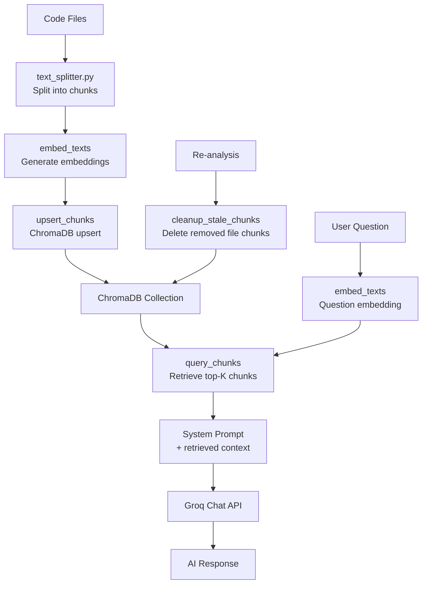

# Architecture

This document outlines the high-level architecture of the project.

## RAG Pipeline (ai-engine)

The ai-engine uses a Retrieval-Augmented Generation (RAG) pipeline to enrich AI code review with repository context. When a user asks a question about the codebase, the system retrieves relevant code snippets from a ChromaDB vector store before generating a response.

### Lifecycle: Split -> Ingest -> Query

The pipeline has three stages, each backed by ChromaDB:

**1. Split (`POST /api/rag/split`)**
Code files are split into text chunks using a language-aware splitter (see `ai-engine/text_splitter.py`). The splitter respects language-specific comment boundaries and preserves structural context. Chunk boundaries are computed with an overlap to avoid cutting mid-function.

**2. Ingest (`POST /api/rag/ingest`)**
Chunks are embedded using a SentenceTransformer model (or a Groq-hosted fallback if the model service is unavailable) and stored in ChromaDB with metadata including `source_file`, `chunk_index`, and `repo_url`. The ingest uses `upsert_chunks` (`ai-engine/rag.py`) which calls `collection.upsert()` — atomically inserting or updating chunks by ID. This avoids the older delete-then-ingest round-trip and is safe under concurrent workers.

**3. Query (`POST /api/rag/query`)**
At query time, the user question is embedded with the same model and used to retrieve the top-K most relevant chunks from ChromaDB via `query_chunks` (`ai-engine/rag.py`). Retrieved chunks are injected into the system prompt as context before calling the Groq chat API.

### Chunk Cleanup

During repository re-analysis, stale chunks must be removed so old code does not pollute new reviews. The `cleanup_stale_chunks` function (`ai-engine/rag.py`) compares the set of files currently in the repository against the `source_file` metadata stored in ChromaDB. Any chunk whose `source_file` no longer appears in the current file set is deleted via `delete_chunks_for_file`. This is triggered by the `POST /api/rag/cleanup` endpoint.

### Fallback Behavior

If the embedding service is unavailable, `embeddings.py` activates `_fallback_active` mode and returns zero vectors. In this state, query results are empty but the service remains available for split and ingest operations. The `is_fallback_active()` helper reports this state.

### Mermaid: RAG Lifecycle

### Key Files

| File | Role |
|------|------|
| `ai-engine/rag.py` | Core RAG functions: `upsert_chunks`, `query_chunks`, `cleanup_stale_chunks`, `delete_chunks_for_file` |
| `ai-engine/embeddings.py` | Embedding generation with SentenceTransformer; fallback zero-vector mode |
| `ai-engine/text_splitter.py` | Language-aware text chunking |
| `ai-engine/app.py` | FastAPI routes for `/api/rag/split`, `/api/rag/ingest`, `/api/rag/query`, `/api/rag/cleanup` |
